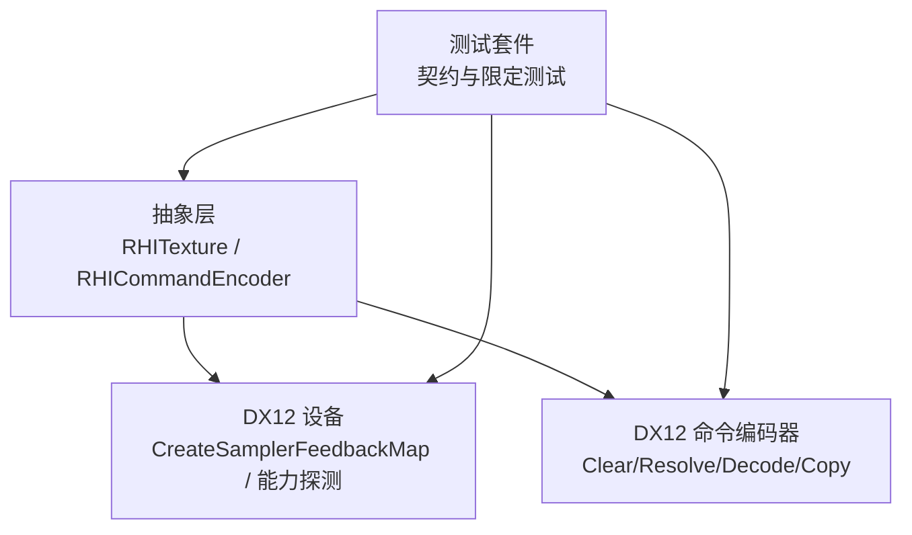
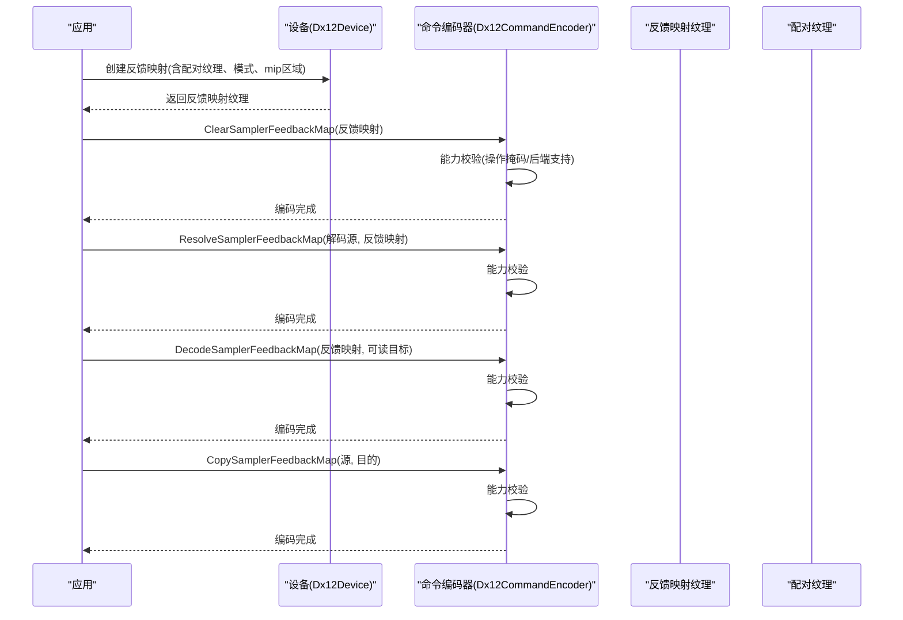
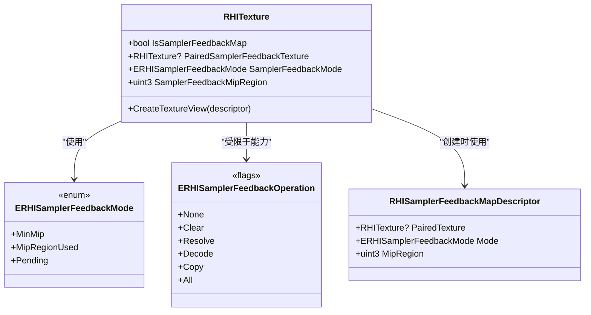
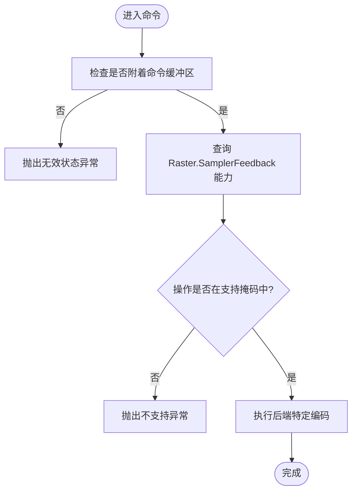
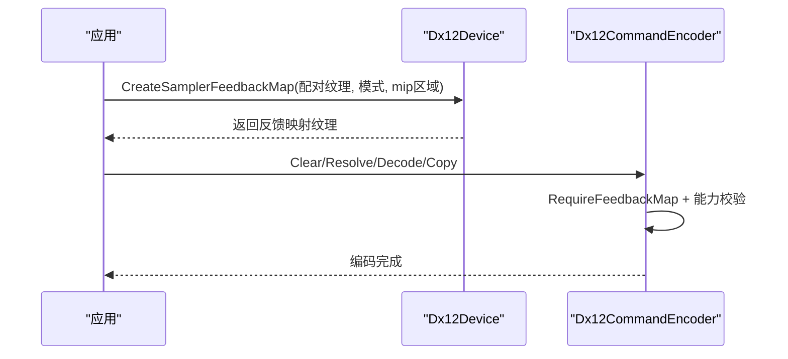
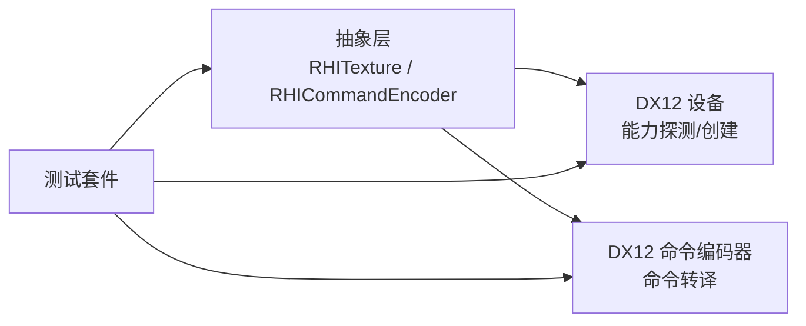

# 采样器反馈

<cite>
**本文引用的文件**
- [RHITexture.cs](file://src/SharpGPU/Abstract/RHITexture.cs)
- [RHICommandEncoder.cs](file://src/SharpGPU/Abstract/RHICommandEncoder.cs)
- [Dx12Device.cs](file://src/SharpGPU/Dx12/Dx12Device.cs)
- [Dx12CommandEncoder.cs](file://src/SharpGPU/Dx12/Dx12CommandEncoder.cs)
- [SamplerFeedbackPortableContractTests.cs](file://tests/SharpGPU.Conformance.Tests/SamplerFeedbackPortableContractTests.cs)
- [SamplerFeedbackWindowsQualifiedTests.cs](file://tests/SharpGPU.Conformance.Tests/SamplerFeedbackWindowsQualifiedTests.cs)
</cite>

## 目录
1. [简介](#简介)
2. [项目结构](#项目结构)
3. [核心组件](#核心组件)
4. [架构总览](#架构总览)
5. [详细组件分析](#详细组件分析)
6. [依赖关系分析](#依赖关系分析)
7. [性能考量](#性能考量)
8. [故障排查指南](#故障排查指南)
9. [结论](#结论)
10. [附录](#附录)

## 简介
本文件系统性说明 SharpGPU 的采样器反馈（Sampler Feedback）能力：其原理、应用场景（动态纹理流式加载与 LOD 优化）、资源创建与配置、命令编码流程、后端支持差异（DX12/Vulkan/Metal），以及性能影响与最佳实践。文档以代码级事实为依据，结合测试用例验证行为边界与兼容性策略。

## 项目结构
采样器反馈在 SharpGPU 中由抽象层定义统一接口，并由具体后端实现。关键位置如下：
- 抽象类型与枚举：位于 Abstract 层，定义反馈模式、操作、描述符与纹理基类扩展。
- 命令编码器：提供 Clear/Resolve/Decode/Copy 等采样器反馈命令的统一入口与能力校验。
- DX12 后端：实现 CreateSamplerFeedbackMap、能力探测、命令转译与 UAV 视图创建。
- 测试：覆盖跨平台契约与 Windows/DX12 限定场景，确保 API 语义与错误路径正确。

图表来源
- [RHITexture.cs:7-37](file://src/SharpGPU/Abstract/RHITexture.cs#L7-L37)
- [RHICommandEncoder.cs:184-276](file://src/SharpGPU/Abstract/RHICommandEncoder.cs#L184-L276)
- [Dx12Device.cs:330-418](file://src/SharpGPU/Dx12/Dx12Device.cs#L330-L418)
- [Dx12CommandEncoder.cs:1850-1928](file://src/SharpGPU/Dx12/Dx12CommandEncoder.cs#L1850-L1928)
- [SamplerFeedbackPortableContractTests.cs:12-143](file://tests/SharpGPU.Conformance.Tests/SamplerFeedbackPortableContractTests.cs#L12-L143)
- [SamplerFeedbackWindowsQualifiedTests.cs:14-133](file://tests/SharpGPU.Conformance.Tests/SamplerFeedbackWindowsQualifiedTests.cs#L14-L133)

章节来源
- [RHITexture.cs:7-37](file://src/SharpGPU/Abstract/RHITexture.cs#L7-L37)
- [RHICommandEncoder.cs:184-276](file://src/SharpGPU/Abstract/RHICommandEncoder.cs#L184-L276)
- [Dx12Device.cs:330-418](file://src/SharpGPU/Dx12/Dx12Device.cs#L330-L418)
- [Dx12CommandEncoder.cs:1850-1928](file://src/SharpGPU/Dx12/Dx12CommandEncoder.cs#L1850-L1928)
- [SamplerFeedbackPortableContractTests.cs:12-143](file://tests/SharpGPU.Conformance.Tests/SamplerFeedbackPortableContractTests.cs#L12-L143)
- [SamplerFeedbackWindowsQualifiedTests.cs:14-133](file://tests/SharpGPU.Conformance.Tests/SamplerFeedbackWindowsQualifiedTests.cs#L14-L133)

## 核心组件
- 反馈模式与操作
  - 反馈模式：最小mip、Mip区域使用、待定（Pending）。
  - 反馈操作：清除、解析（解码回写）、解码（透明格式到可读）、拷贝。
- 描述符与纹理
  - 反馈映射描述符包含配对纹理、模式与可选的 mip 区域。
  - 纹理基类新增属性用于标识是否为反馈映射、配对纹理、模式与 mip 区域。
- 命令编码器
  - 提供 Clear/Resolve/Decode/Copy 四个入口，并在执行前进行能力与参数校验。
- DX12 后端
  - 根据驱动能力探测支持的反馈模式与操作掩码。
  - 创建反馈映射纹理，绑定配对纹理，生成专用格式与用途。
  - 将高层命令转译为底层命令（如 ENCODE/DECODE_SAMPLER_FEEDBACK）。

章节来源
- [RHITexture.cs:7-37](file://src/SharpGPU/Abstract/RHITexture.cs#L7-L37)
- [RHITexture.cs:50-138](file://src/SharpGPU/Abstract/RHITexture.cs#L50-L138)
- [RHICommandEncoder.cs:184-276](file://src/SharpGPU/Abstract/RHICommandEncoder.cs#L184-L276)
- [Dx12Device.cs:330-418](file://src/SharpGPU/Dx12/Dx12Device.cs#L330-L418)
- [Dx12CommandEncoder.cs:1850-1928](file://src/SharpGPU/Dx12/Dx12CommandEncoder.cs#L1850-L1928)

## 架构总览
下图展示从应用调用到 DX12 后端的完整链路，包括资源创建、命令编码与数据流转。

图表来源
- [Dx12Device.cs:330-418](file://src/SharpGPU/Dx12/Dx12Device.cs#L330-L418)
- [Dx12CommandEncoder.cs:1850-1928](file://src/SharpGPU/Dx12/Dx12CommandEncoder.cs#L1850-L1928)
- [RHICommandEncoder.cs:184-276](file://src/SharpGPU/Abstract/RHICommandEncoder.cs#L184-L276)

## 详细组件分析

### 抽象层：反馈模式、操作与纹理
- 反馈模式
  - MinMip：记录每个采样点的最小可用 mip 级别。
  - MipRegionUsed：记录哪些 mip 区域被实际使用。
  - Pending：未确定或占位值。
- 反馈操作
  - Clear：清零反馈映射。
  - Resolve：将可读的 R8_UINT 解码回写为透明反馈格式。
  - Decode：将透明反馈格式解码为可读的 R8_UINT。
  - Copy：在同格式同尺寸的反馈映射间拷贝。
- 纹理扩展
  - IsSamplerFeedbackMap：标识是否由 CreateSamplerFeedbackMap 创建的透明反馈映射。
  - PairedSamplerFeedbackTexture：创建时绑定的采样纹理（不拥有所有权）。
  - SamplerFeedbackMode/SamplerFeedbackMipRegion：反馈模式与 mip 区域。

图表来源
- [RHITexture.cs:7-37](file://src/SharpGPU/Abstract/RHITexture.cs#L7-L37)
- [RHITexture.cs:50-138](file://src/SharpGPU/Abstract/RHITexture.cs#L50-L138)

章节来源
- [RHITexture.cs:7-37](file://src/SharpGPU/Abstract/RHITexture.cs#L7-L37)
- [RHITexture.cs:50-138](file://src/SharpGPU/Abstract/RHITexture.cs#L50-L138)

### 命令编码器：统一入口与能力校验
- 统一入口
  - ClearSamplerFeedbackMap：清空反馈映射。
  - ResolveSamplerFeedbackMap：将可读数据回写到透明反馈映射。
  - DecodeSamplerFeedbackMap：将透明反馈映射解码为可读数据。
  - CopySamplerFeedbackMap：在同格式同尺寸反馈映射间拷贝。
- 能力校验
  - 要求当前编码器已附着到命令缓冲区。
  - 查询设备栅格能力的 SamplerFeedback，并检查操作是否在 SupportedSamplerFeedbackOperationMask 中。
  - 若不支持则抛出 NotSupportedException。

图表来源
- [RHICommandEncoder.cs:184-276](file://src/SharpGPU/Abstract/RHICommandEncoder.cs#L184-L276)

章节来源
- [RHICommandEncoder.cs:184-276](file://src/SharpGPU/Abstract/RHICommandEncoder.cs#L184-L276)

### DX12 后端：资源创建、能力探测与命令转译
- 资源创建
  - 基于配对纹理的维度与大小创建反馈映射纹理，选择透明格式（MinMip 或 MipRegionUsed）。
  - 设置存储模式为 GPU Local，用途包含 UAV、CopySrc、CopyDst。
  - 绑定配对纹理与模式、mip 区域。
- 能力探测
  - 通过 D3D12 Options7 的 SamplerFeedbackTier 判断 Tier1/Tier2 或不可用。
  - 暴露 SupportedSamplerFeedbackModeMask 与 SupportedSamplerFeedbackOperationMask。
- 命令转译
  - Clear：调用底层 Clear 命令。
  - Resolve/Decode：调用 Transcode（ENCODE/DECODE_SAMPLER_FEEDBACK）。
  - Copy：调用底层 Copy 命令。
  - 所有命令均先进行反馈映射类型与能力校验。

图表来源
- [Dx12Device.cs:330-418](file://src/SharpGPU/Dx12/Dx12Device.cs#L330-L418)
- [Dx12CommandEncoder.cs:1850-1928](file://src/SharpGPU/Dx12/Dx12CommandEncoder.cs#L1850-L1928)

章节来源
- [Dx12Device.cs:330-418](file://src/SharpGPU/Dx12/Dx12Device.cs#L330-L418)
- [Dx12CommandEncoder.cs:1850-1928](file://src/SharpGPU/Dx12/Dx12CommandEncoder.cs#L1850-L1928)

### 测试与行为约束
- 跨平台契约
  - 断言 RHIRasterCapabilities 暴露 SamplerFeedback。
  - 断言旧名称 SampledFeedback 不存在。
  - 断言存在 SupportedSamplerFeedbackModeMask 与 SupportedSamplerFeedbackOperationMask。
  - 断言设备与编码器具备相应方法。
- Vulkan/Metal 不支持
  - 在 Vulkan 与 Metal 上，SamplerFeedback 能力为 Unavailable，且不可创建反馈映射。
  - 尝试创建会抛出 NotSupportedException，并提示“DX12-only”。
- DX12 限定
  - 需要配对纹理；缺少配对会抛出 ArgumentException。
  - 合法 2D 纹理可成功创建反馈映射，IsSamplerFeedbackMap 为真，格式为透明格式。
  - 能力层级与原生 SamplerFeedbackTier 对应。

章节来源
- [SamplerFeedbackPortableContractTests.cs:12-143](file://tests/SharpGPU.Conformance.Tests/SamplerFeedbackPortableContractTests.cs#L12-L143)
- [SamplerFeedbackWindowsQualifiedTests.cs:14-133](file://tests/SharpGPU.Conformance.Tests/SamplerFeedbackWindowsQualifiedTests.cs#L14-L133)

## 依赖关系分析
- 抽象层对后端无直接依赖，仅定义能力与命令接口。
- DX12 后端依赖原生能力探测（Options7）与命令转译工具。
- 测试依赖运行时环境，区分跨平台与 Windows 限定场景。

图表来源
- [RHITexture.cs:7-37](file://src/SharpGPU/Abstract/RHITexture.cs#L7-L37)
- [RHICommandEncoder.cs:184-276](file://src/SharpGPU/Abstract/RHICommandEncoder.cs#L184-L276)
- [Dx12Device.cs:330-418](file://src/SharpGPU/Dx12/Dx12Device.cs#L330-L418)
- [Dx12CommandEncoder.cs:1850-1928](file://src/SharpGPU/Dx12/Dx12CommandEncoder.cs#L1850-L1928)
- [SamplerFeedbackPortableContractTests.cs:12-143](file://tests/SharpGPU.Conformance.Tests/SamplerFeedbackPortableContractTests.cs#L12-L143)
- [SamplerFeedbackWindowsQualifiedTests.cs:14-133](file://tests/SharpGPU.Conformance.Tests/SamplerFeedbackWindowsQualifiedTests.cs#L14-L133)

章节来源
- [RHITexture.cs:7-37](file://src/SharpGPU/Abstract/RHITexture.cs#L7-L37)
- [RHICommandEncoder.cs:184-276](file://src/SharpGPU/Abstract/RHICommandEncoder.cs#L184-L276)
- [Dx12Device.cs:330-418](file://src/SharpGPU/Dx12/Dx12Device.cs#L330-L418)
- [Dx12CommandEncoder.cs:1850-1928](file://src/SharpGPU/Dx12/Dx12CommandEncoder.cs#L1850-L1928)
- [SamplerFeedbackPortableContractTests.cs:12-143](file://tests/SharpGPU.Conformance.Tests/SamplerFeedbackPortableContractTests.cs#L12-L143)
- [SamplerFeedbackWindowsQualifiedTests.cs:14-133](file://tests/SharpGPU.Conformance.Tests/SamplerFeedbackWindowsQualifiedTests.cs#L14-L133)

## 性能考量
- 反馈频率控制
  - 仅在必要时执行 Clear/Decode/Resolve，避免每帧全量处理。
  - 使用 Copy 合并多次更新，减少命令提交次数。
- 内存使用优化
  - 反馈映射使用 GPU Local 存储，降低带宽压力。
  - 合理设置 mip 区域，仅统计必要范围。
- 解码与回写
  - Decode 将透明格式转为可读 R8_UINT，便于 CPU/GPU 分析。
  - Resolve 将可读结果回写为透明格式，供后续采样阶段使用。
- 能力与降级
  - 在非 DX12 后端不可用时，应跳过反馈相关路径，避免额外开销。

[本节为通用指导，无需列出具体文件来源]

## 故障排查指南
- 常见异常与原因
  - 未附着命令缓冲区：调用反馈命令前需确保编码器已附着到命令缓冲区。
  - 操作不受支持：当设备能力掩码不包含所需操作时，会抛出不支持异常。
  - 非反馈映射纹理：传入的纹理不是通过 CreateSamplerFeedbackMap 创建的透明反馈映射。
  - 缺少配对纹理：创建反馈映射时必须提供配对纹理，否则抛出参数异常。
  - 非 DX12 后端：Vulkan/Metal 上 SamplerFeedback 不可用，创建或调用将抛出不支持异常。
- 定位建议
  - 检查设备能力中的 Raster.SamplerFeedback 与操作掩码。
  - 确认纹理 IsSamplerFeedbackMap 为真，且格式为透明反馈格式。
  - 在 DX12 上确认 SamplerFeedbackTier 与期望层级一致。

章节来源
- [RHICommandEncoder.cs:184-276](file://src/SharpGPU/Abstract/RHICommandEncoder.cs#L184-L276)
- [Dx12CommandEncoder.cs:1850-1928](file://src/SharpGPU/Dx12/Dx12CommandEncoder.cs#L1850-L1928)
- [SamplerFeedbackPortableContractTests.cs:12-143](file://tests/SharpGPU.Conformance.Tests/SamplerFeedbackPortableContractTests.cs#L12-L143)
- [SamplerFeedbackWindowsQualifiedTests.cs:14-133](file://tests/SharpGPU.Conformance.Tests/SamplerFeedbackWindowsQualifiedTests.cs#L14-L133)

## 结论
SharpGPU 的采样器反馈在抽象层提供了统一的模式、操作与命令接口，并在 DX12 后端实现了完整的资源创建、能力探测与命令转译。测试覆盖了跨平台契约与 Windows 限定场景，明确了不可用后端的降级策略。实践中应结合能力检测、反馈频率控制与内存优化，以获得稳定的性能收益。

[本节为总结性内容，无需列出具体文件来源]

## 附录
- 典型工作流
  - 创建反馈映射：指定配对纹理、模式与 mip 区域。
  - 渲染阶段：采样器写入反馈映射（由驱动/管线内部完成）。
  - 解码与分析：Decode 获取可读数据，CPU/GPU 分析使用分布。
  - 回写与复制：Resolve 回写透明格式，Copy 合并更新。
- 参考路径
  - 抽象接口与类型：RHITexture.cs、RHICommandEncoder.cs
  - DX12 实现：Dx12Device.cs、Dx12CommandEncoder.cs
  - 测试用例：SamplerFeedbackPortableContractTests.cs、SamplerFeedbackWindowsQualifiedTests.cs

[本节为补充信息，无需列出具体文件来源]