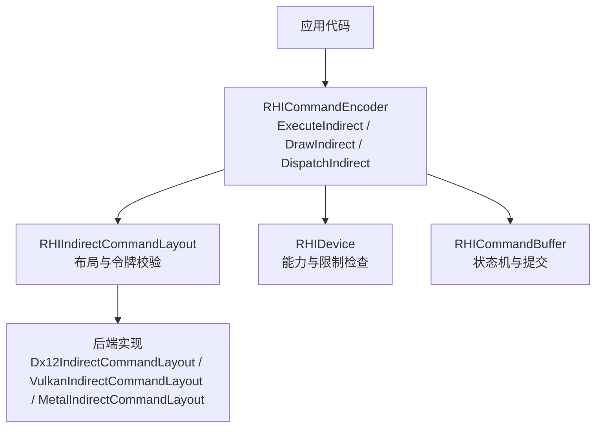
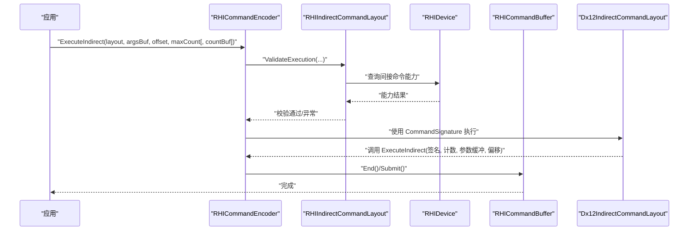
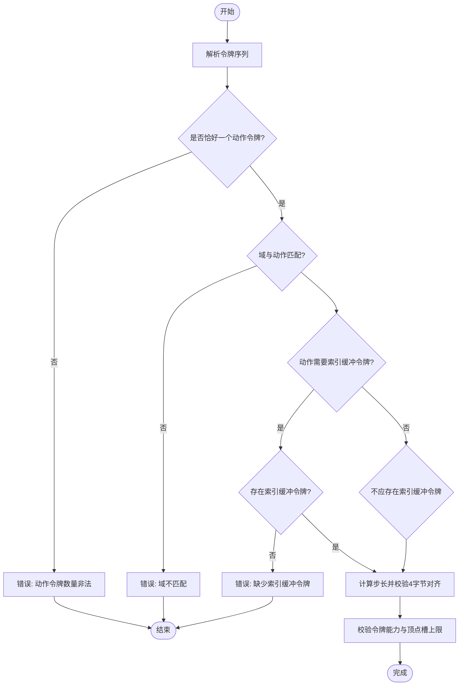
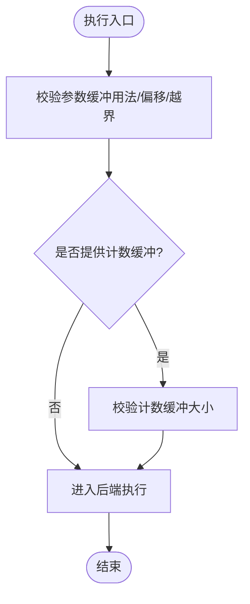
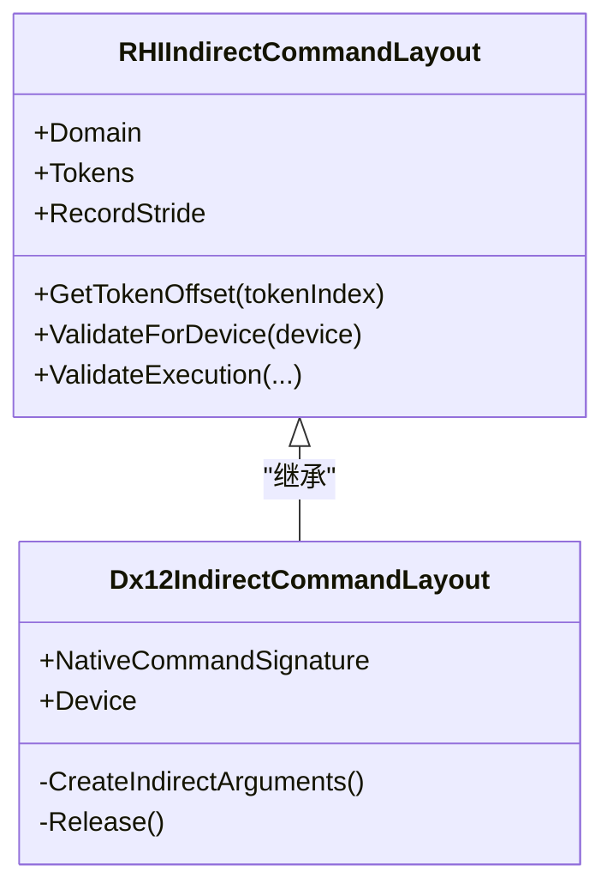
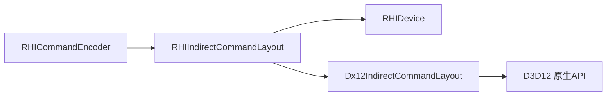

# 间接命令

<cite>
**本文引用的文件**
- [RHIIndirectCommandLayout.cs](file://src/SharpGPU/Abstract/RHIIndirectCommandLayout.cs)
- [Dx12IndirectCommandLayout.cs](file://src/SharpGPU/Dx12/Dx12IndirectCommandLayout.cs)
- [VulkanIndirectCommandLayout.cs](file://src/SharpGPU/Vulkan/VulkanIndirectCommandLayout.cs)
- [MetalIndirectCommandLayout.cs](file://src/SharpGPU/Metal/MetalIndirectCommandLayout.cs)
- [RHICommandEncoder.cs](file://src/SharpGPU/Abstract/RHICommandEncoder.cs)
- [RHICommandBuffer.cs](file://src/SharpGPU/Abstract/RHICommandBuffer.cs)
- [RHIDevice.cs](file://src/SharpGPU/Abstract/RHIDevice.cs)
- [Dx12CommandEncoder.cs](file://src/SharpGPU/Dx12/Dx12CommandEncoder.cs)
- [IndirectCommandLayoutBoundaryTests.cs](file://tests/SharpGPU.Conformance.Tests/IndirectCommandLayoutBoundaryTests.cs)
</cite>

## 目录
1. [简介](#简介)
2. [项目结构](#项目结构)
3. [核心组件](#核心组件)
4. [架构总览](#架构总览)
5. [详细组件分析](#详细组件分析)
6. [依赖关系分析](#依赖关系分析)
7. [性能考量](#性能考量)
8. [故障排查指南](#故障排查指南)
9. [结论](#结论)
10. [附录](#附录)

## 简介
本文件系统性阐述 SharpGPU 的“间接命令（Indirect Command）”能力，包括概念、重要性、布局定义、参数传递机制与执行流程，覆盖绘制间接（Draw Indirect）、索引绘制间接（DrawIndexedIndirect）、计算间接（Dispatch Indirect）等类型的使用方式。文档还给出批量渲染示例思路、不同后端（Direct3D 12、Vulkan、Metal）的支持差异与优化建议，以及内存管理与命令缓冲优化要点。

间接命令的核心价值在于：将大量绘制/计算调用从 CPU 侧循环中解耦，改为在 GPU 可访问的缓冲区中以固定步长写入“指令记录”，由 GPU 一次性读取并执行。这显著降低 CPU-GPU 同步开销，提升批处理吞吐，是现代图形与计算管线实现高效实例化渲染的关键技术之一。

## 项目结构
SharpGPU 对间接命令的抽象位于 Abstract 层，具体后端实现位于 Dx12、Vulkan、Metal 子目录；命令编码器提供统一的 ExecuteIndirect/DrawIndirect/DispatchIndirect 等接口；设备能力描述用于声明各平台支持度。测试用例验证公共 API 边界与类型隔离。

图表来源
- [RHICommandEncoder.cs:150-173](file://src/SharpGPU/Abstract/RHICommandEncoder.cs#L150-L173)
- [RHIIndirectCommandLayout.cs:157-255](file://src/SharpGPU/Abstract/RHIIndirectCommandLayout.cs#L157-L255)
- [Dx12IndirectCommandLayout.cs:11-34](file://src/SharpGPU/Dx12/Dx12IndirectCommandLayout.cs#L11-L34)
- [RHICommandBuffer.cs:26-164](file://src/SharpGPU/Abstract/RHICommandBuffer.cs#L26-L164)

章节来源
- [RHICommandEncoder.cs:150-173](file://src/SharpGPU/Abstract/RHICommandEncoder.cs#L150-L173)
- [RHIIndirectCommandLayout.cs:157-255](file://src/SharpGPU/Abstract/RHIIndirectCommandLayout.cs#L157-L255)
- [Dx12IndirectCommandLayout.cs:11-34](file://src/SharpGPU/Dx12/Dx12IndirectCommandLayout.cs#L11-L34)
- [RHICommandBuffer.cs:26-164](file://src/SharpGPU/Abstract/RHICommandBuffer.cs#L26-L164)

## 核心组件
- RHIIndirectCommandLayout：定义间接命令的“令牌序列”与记录步长，负责令牌合法性、对齐、域匹配与设备能力校验。
- 后端布局实现：
  - Dx12IndirectCommandLayout：创建 ID3D12CommandSignature，映射令牌到 Direct3D 12 的 IndirectArgumentDescription。
  - VulkanIndirectCommandLayout / MetalIndirectCommandLayout：当前仅做能力校验占位，未暴露原生对象。
- RHICommandEncoder：提供 ExecuteIndirect（布局驱动）、DrawIndirect、DrawIndexedIndirect、DispatchIndirect 等统一接口；默认基类对未实现的后端抛出 NotSupportedException。
- RHIDevice：通过 RHIRasterCapabilities 等能力对象声明 DrawIndirect、MultiDrawIndirect 等支持情况。
- RHICommandBuffer：管理命令缓冲状态（初始/录制/可执行/已提交），确保正确生命周期。

章节来源
- [RHIIndirectCommandLayout.cs:7-27](file://src/SharpGPU/Abstract/RHIIndirectCommandLayout.cs#L7-L27)
- [RHIIndirectCommandLayout.cs:29-72](file://src/SharpGPU/Abstract/RHIIndirectCommandLayout.cs#L29-L72)
- [RHIIndirectCommandLayout.cs:157-255](file://src/SharpGPU/Abstract/RHIIndirectCommandLayout.cs#L157-L255)
- [Dx12IndirectCommandLayout.cs:11-34](file://src/SharpGPU/Dx12/Dx12IndirectCommandLayout.cs#L11-L34)
- [RHICommandEncoder.cs:150-173](file://src/SharpGPU/Abstract/RHICommandEncoder.cs#L150-L173)
- [RHICommandEncoder.cs:1994-2043](file://src/SharpGPU/Abstract/RHICommandEncoder.cs#L1994-L2043)
- [RHIDevice.cs:1397-1456](file://src/SharpGPU/Abstract/RHIDevice.cs#L1397-L1456)
- [RHICommandBuffer.cs:26-164](file://src/SharpGPU/Abstract/RHICommandBuffer.cs#L26-L164)

## 架构总览
下图展示从应用调用到后端执行的端到端流程，涵盖布局构建、参数缓冲、命令编码与提交。

图表来源
- [RHICommandEncoder.cs:150-173](file://src/SharpGPU/Abstract/RHICommandEncoder.cs#L150-L173)
- [RHIIndirectCommandLayout.cs:296-334](file://src/SharpGPU/Abstract/RHIIndirectCommandLayout.cs#L296-L334)
- [Dx12IndirectCommandLayout.cs:20-34](file://src/SharpGPU/Dx12/Dx12IndirectCommandLayout.cs#L20-L34)
- [RHICommandBuffer.cs:122-164](file://src/SharpGPU/Abstract/RHICommandBuffer.cs#L122-L164)

## 详细组件分析

### 间接命令布局与令牌系统
- 令牌类型：顶点缓冲、索引缓冲、绘制、索引绘制、调度、网格调度。
- 布局约束：
  - 必须包含且仅包含一个“动作令牌”（Draw/DrawIndexed/Dispatch/DispatchMesh），且必须位于末尾。
  - Compute 域仅允许终端 Dispatch；Raster 域允许 Draw/DrawIndexed/DispatchMesh。
  - 顶点缓冲槽唯一性、索引缓冲最多一个、记录步长四字节对齐。
  - 根据动作令牌决定是否需要索引缓冲令牌。
- 记录大小：不同令牌有固定大小（如 Draw 16B、DrawIndexed 20B、Dispatch/DispatchMesh 12B、缓冲令牌 16B）。
- 设备能力校验：每个令牌需对应能力项；顶点槽不得超过设备上限。

图表来源
- [RHIIndirectCommandLayout.cs:175-255](file://src/SharpGPU/Abstract/RHIIndirectCommandLayout.cs#L175-L255)
- [RHIIndirectCommandLayout.cs:360-407](file://src/SharpGPU/Abstract/RHIIndirectCommandLayout.cs#L360-L407)

章节来源
- [RHIIndirectCommandLayout.cs:7-27](file://src/SharpGPU/Abstract/RHIIndirectCommandLayout.cs#L7-L27)
- [RHIIndirectCommandLayout.cs:157-255](file://src/SharpGPU/Abstract/RHIIndirectCommandLayout.cs#L157-L255)
- [RHIIndirectCommandLayout.cs:360-407](file://src/SharpGPU/Abstract/RHIIndirectCommandLayout.cs#L360-L407)

### 参数缓冲与执行校验
- 参数缓冲要求：
  - 必须标记为 IndirectBuffer 用法。
  - 偏移与记录步长均须四字节对齐。
  - 最大命令数乘以记录步长的范围不得越界。
- 可选计数缓冲：若提供，则需校验其大小足以容纳一个 uint。
- 执行前校验：布局、参数缓冲、计数缓冲的生命周期与有效性。

图表来源
- [RHIIndirectCommandLayout.cs:296-334](file://src/SharpGPU/Abstract/RHIIndirectCommandLayout.cs#L296-L334)
- [RHIIndirectCommandLayout.cs:336-358](file://src/SharpGPU/Abstract/RHIIndirectCommandLayout.cs#L336-L358)

章节来源
- [RHIIndirectCommandLayout.cs:296-334](file://src/SharpGPU/Abstract/RHIIndirectCommandLayout.cs#L296-L334)
- [RHIIndirectCommandLayout.cs:336-358](file://src/SharpGPU/Abstract/RHIIndirectCommandLayout.cs#L336-L358)

### 后端实现：Direct3D 12
- 布局创建：基于令牌序列生成 IndirectArgumentDescription 数组，并通过设备创建 ID3D12CommandSignature。
- 执行路径：
  - 计算间接：使用预创建的 DispatchComputeIndirectSignature 调用 ExecuteIndirect。
  - 光栅间接：使用 DrawIndirectSignature / DrawIndexedIndirectSignature 调用 ExecuteIndirect。
- 同步屏障：在执行间接命令前后插入必要的 BarrierSync（如 ExecuteIndirect）以保证数据就绪。

图表来源
- [RHIIndirectCommandLayout.cs:157-255](file://src/SharpGPU/Abstract/RHIIndirectCommandLayout.cs#L157-L255)
- [Dx12IndirectCommandLayout.cs:11-34](file://src/SharpGPU/Dx12/Dx12IndirectCommandLayout.cs#L11-L34)
- [Dx12IndirectCommandLayout.cs:36-80](file://src/SharpGPU/Dx12/Dx12IndirectCommandLayout.cs#L36-L80)

章节来源
- [Dx12IndirectCommandLayout.cs:11-34](file://src/SharpGPU/Dx12/Dx12IndirectCommandLayout.cs#L11-L34)
- [Dx12IndirectCommandLayout.cs:36-80](file://src/SharpGPU/Dx12/Dx12IndirectCommandLayout.cs#L36-L80)
- [Dx12CommandEncoder.cs:1793-1839](file://src/SharpGPU/Dx12/Dx12CommandEncoder.cs#L1793-L1839)
- [Dx12CommandEncoder.cs:3828-3845](file://src/SharpGPU/Dx12/Dx12CommandEncoder.cs#L3828-L3845)

### 后端实现：Vulkan 与 Metal
- 当前实现仅进行能力校验与生命周期管理，未暴露原生对象或特定执行细节。
- 这意味着在 Vulkan/Metal 后端，ExecuteIndirect 的布局驱动执行可能以基类默认实现返回“不支持”。

章节来源
- [VulkanIndirectCommandLayout.cs:1-18](file://src/SharpGPU/Vulkan/VulkanIndirectCommandLayout.cs#L1-L18)
- [MetalIndirectCommandLayout.cs:1-18](file://src/SharpGPU/Metal/MetalIndirectCommandLayout.cs#L1-L18)
- [RHICommandEncoder.cs:159-173](file://src/SharpGPU/Abstract/RHICommandEncoder.cs#L159-L173)
- [RHICommandEncoder.cs:2028-2043](file://src/SharpGPU/Abstract/RHICommandEncoder.cs#L2028-L2043)

### 命令编码器与命令缓冲
- 命令编码器：
  - 提供 ExecuteIndirect（布局驱动）、DrawIndirect、DrawIndexedIndirect、DispatchIndirect 等方法。
  - 基类默认实现对于未覆盖的后端抛出 NotSupportedException。
- 命令缓冲：
  - 维护状态机（Initial/Recording/Executable/Submitted/InvalidRecording）。
  - 确保 Begin/End/Submit 的正确顺序与编码器生命周期。

章节来源
- [RHICommandEncoder.cs:150-173](file://src/SharpGPU/Abstract/RHICommandEncoder.cs#L150-L173)
- [RHICommandEncoder.cs:1994-2043](file://src/SharpGPU/Abstract/RHICommandEncoder.cs#L1994-L2043)
- [RHICommandBuffer.cs:26-164](file://src/SharpGPU/Abstract/RHICommandBuffer.cs#L26-L164)

## 依赖关系分析
- 耦合关系：
  - 命令编码器依赖布局进行参数校验与能力检查。
  - 布局依赖设备能力与限制（如顶点输入绑定上限）。
  - 后端布局依赖原生 API（如 D3D12 的 CommandSignature）。
- 外部依赖：
  - D3D12：通过 Vortice.Direct3D12 封装调用 ExecuteIndirect。
  - Vulkan/Metal：当前未实现布局驱动执行的具体调用。

图表来源
- [RHICommandEncoder.cs:150-173](file://src/SharpGPU/Abstract/RHICommandEncoder.cs#L150-L173)
- [RHIIndirectCommandLayout.cs:267-294](file://src/SharpGPU/Abstract/RHIIndirectCommandLayout.cs#L267-L294)
- [Dx12IndirectCommandLayout.cs:20-34](file://src/SharpGPU/Dx12/Dx12IndirectCommandLayout.cs#L20-L34)

章节来源
- [RHIIndirectCommandLayout.cs:267-294](file://src/SharpGPU/Abstract/RHIIndirectCommandLayout.cs#L267-L294)
- [Dx12IndirectCommandLayout.cs:20-34](file://src/SharpGPU/Dx12/Dx12IndirectCommandLayout.cs#L20-L34)

## 性能考量
- 减少 CPU 调用次数：将 N 次绘制/调度合并为一次 ExecuteIndirect，降低 CPU-GPU 同步与驱动开销。
- 参数缓冲组织：
  - 使用连续内存并按记录步长对齐，避免跨页与碎片。
  - 合理划分批次，平衡单次 ExecuteIndirect 的命令数量与 GPU 并行度。
- 同步与屏障：
  - 在间接命令执行前后插入必要屏障，确保参数缓冲与资源可见性。
  - 利用设备能力选择最小化的同步点。
- 内存管理策略：
  - 复用参数缓冲与计数缓冲，减少分配与拷贝。
  - 使用 IndirectBuffer 专用用途标志，避免误用导致额外拷贝或验证失败。
- 后端差异：
  - D3D12：具备成熟的 CommandSignature 与 ExecuteIndirect 路径，适合大规模间接命令。
  - Vulkan/Metal：当前布局驱动执行未完全实现，需关注后续扩展与替代方案。

[本节为通用性能指导，不直接分析具体文件]

## 故障排查指南
- 常见错误与定位：
  - “未知令牌类型/域不匹配/动作令牌位置错误”：检查令牌序列与域配置。
  - “索引缓冲令牌缺失/多余”：根据动作令牌类型确认是否需要索引缓冲令牌。
  - “记录步长非4字节对齐/偏移非4字节对齐”：调整布局与缓冲偏移。
  - “参数缓冲未标记 IndirectBuffer”：修改缓冲用途标志。
  - “超出参数缓冲范围/计数缓冲过小”：检查 maximumCommandCount 与缓冲大小。
  - “后端不支持布局驱动执行”：检查 ExecuteIndirect 是否被覆盖，或改用传统 Draw/Dispatch 间接调用。
- 调试建议：
  - 打印令牌序列与记录步长，核对布局构造逻辑。
  - 使用命令缓冲状态断言，确保 Begin/End/Submit 顺序正确。
  - 在后端执行前后添加时间戳或日志，定位瓶颈。

章节来源
- [RHIIndirectCommandLayout.cs:175-255](file://src/SharpGPU/Abstract/RHIIndirectCommandLayout.cs#L175-L255)
- [RHIIndirectCommandLayout.cs:296-334](file://src/SharpGPU/Abstract/RHIIndirectCommandLayout.cs#L296-L334)
- [RHICommandEncoder.cs:159-173](file://src/SharpGPU/Abstract/RHICommandEncoder.cs#L159-L173)
- [RHICommandEncoder.cs:1994-2043](file://src/SharpGPU/Abstract/RHICommandEncoder.cs#L1994-L2043)

## 结论
SharpGPU 通过统一的 RHIIndirectCommandLayout 与 RHICommandEncoder 抽象，提供了跨后端的间接命令能力。D3D12 后端已完整实现布局驱动执行与相关调用；Vulkan/Metal 后端当前以能力校验为主，尚未暴露布局驱动执行的具体实现。采用间接命令可显著降低 CPU 开销、提升批量渲染效率；配合合理的参数缓冲组织、同步屏障与内存复用策略，可在实际项目中获得可观的性能收益。

[本节为总结性内容，不直接分析具体文件]

## 附录

### 间接命令类型与使用方法速查
- 绘制间接（Draw Indirect）：适用于无索引的顶点绘制批量。
- 索引绘制间接（DrawIndexedIndirect）：适用于带索引的顶点绘制批量。
- 计算间接（Dispatch Indirect）：适用于计算着色器批量调度。
- 网格调度间接（DispatchMesh Indirect）：适用于网格着色器批量调度。

章节来源
- [RHIIndirectCommandLayout.cs:7-27](file://src/SharpGPU/Abstract/RHIIndirectCommandLayout.cs#L7-L27)
- [RHICommandEncoder.cs:1994-2043](file://src/SharpGPU/Abstract/RHICommandEncoder.cs#L1994-L2043)

### 批量渲染示例（思路）
- 准备参数缓冲：按记录步长写入多个 Draw/DrawIndexed/Dispatch 记录。
- 设置布局：根据令牌序列创建 RHIIndirectCommandLayout。
- 编码命令：调用 ExecuteIndirect，传入参数缓冲与最大命令数。
- 提交执行：结束命令缓冲并提交到队列。
- 复用缓冲：在多帧或多批次间复用参数缓冲与计数缓冲，减少分配。

章节来源
- [RHIIndirectCommandLayout.cs:296-334](file://src/SharpGPU/Abstract/RHIIndirectCommandLayout.cs#L296-L334)
- [RHICommandEncoder.cs:159-173](file://src/SharpGPU/Abstract/RHICommandEncoder.cs#L159-L173)

### 后端支持与能力
- D3D12：
  - 支持 CommandSignature 与 ExecuteIndirect。
  - 提供 DrawIndirect/DrawIndexedIndirect/DispatchIndirect 的直接调用路径。
- Vulkan/Metal：
  - 当前布局驱动执行未实现，ExecuteIndirect 默认返回不支持。
  - 可通过传统间接调用（如 DrawIndirect/DispatchIndirect）获得部分收益。

章节来源
- [Dx12IndirectCommandLayout.cs:20-34](file://src/SharpGPU/Dx12/Dx12IndirectCommandLayout.cs#L20-L34)
- [Dx12CommandEncoder.cs:1793-1839](file://src/SharpGPU/Dx12/Dx12CommandEncoder.cs#L1793-L1839)
- [Dx12CommandEncoder.cs:3828-3845](file://src/SharpGPU/Dx12/Dx12CommandEncoder.cs#L3828-L3845)
- [RHICommandEncoder.cs:159-173](file://src/SharpGPU/Abstract/RHICommandEncoder.cs#L159-L173)
- [RHICommandEncoder.cs:2028-2043](file://src/SharpGPU/Abstract/RHICommandEncoder.cs#L2028-L2043)

### 公共 API 边界与测试
- 测试确保 RHIIndirectCommandLayout 与 WorkGraph 相关类型为独立公开类型。
- 测试禁止暴露设备生成命令与预处理缓冲相关名称，保证 API 边界清晰。

章节来源
- [IndirectCommandLayoutBoundaryTests.cs:12-60](file://tests/SharpGPU.Conformance.Tests/IndirectCommandLayoutBoundaryTests.cs#L12-L60)