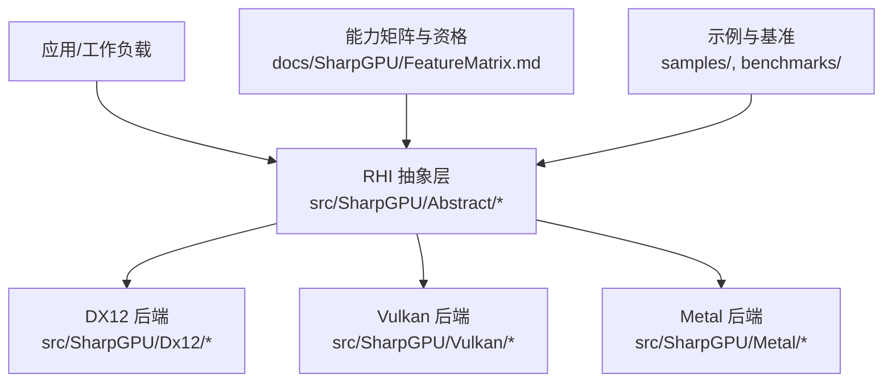
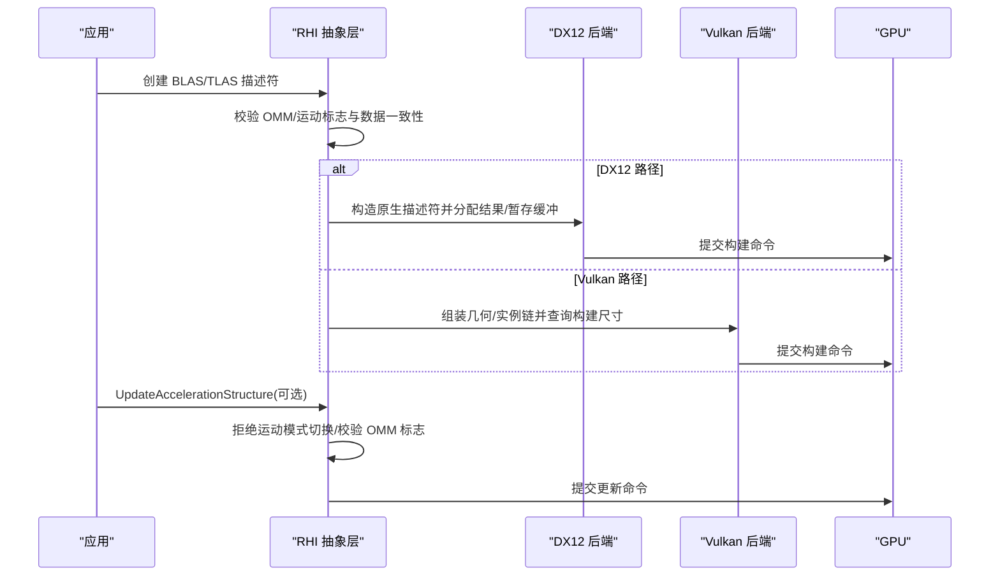
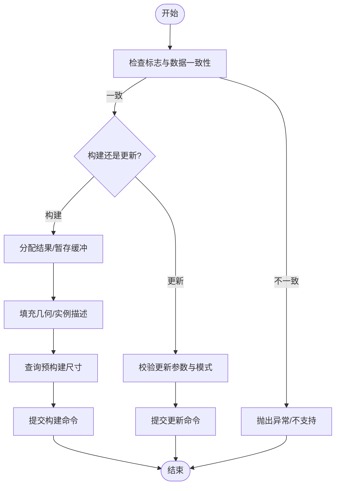
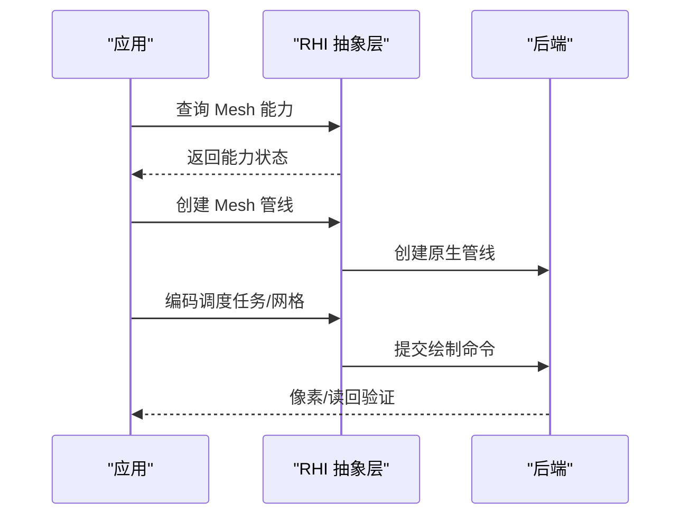
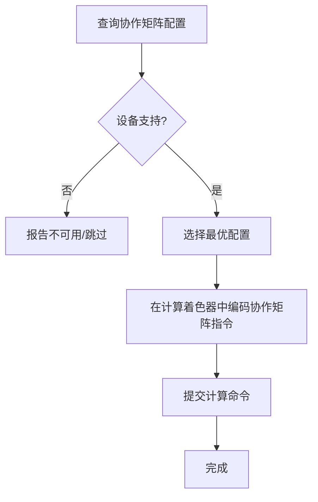
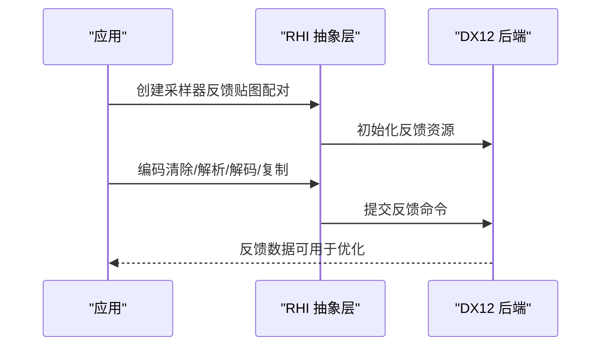
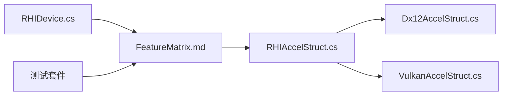

# 高级特性

<cite>
**本文引用的文件**
- [README.md](file://README.md)
- [FeatureMatrix.md](file://docs/SharpGPU/FeatureMatrix.md)
- [PackageReadme.md](file://docs/SharpGPU/PackageReadme.md)
- [RHIAccelStruct.cs](file://src/SharpGPU\Abstract\RHIAccelStruct.cs)
- [Dx12AccelStruct.cs](file://src/SharpGPU\Dx12\Dx12AccelStruct.cs)
- [VulkanAccelStruct.cs](file://src/SharpGPU\Vulkan\VulkanAccelStruct.cs)
- [RHIDevice.cs](file://src/SharpGPU\Abstract\RHIDevice.cs)
- [MeshShadingPortableContractTests.cs](file://tests/SharpGPU.Conformance.Tests\MeshShadingPortableContractTests.cs)
- [MeshShadingWindowsQualifiedTests.cs](file://tests/SharpGPU.Conformance.Tests\MeshShadingWindowsQualifiedTests.cs)
- [MeshShadingVulkanQualifiedTests.cs](file://tests/SharpGPU.Conformance.Tests\MeshShadingVulkanQualifiedTests.cs)
- [SamplerFeedbackPortableContractTests.cs](file://tests/SharpGPU.Conformance.Tests\SamplerFeedbackPortableContractTests.cs)
- [SamplerFeedbackWindowsQualifiedTests.cs](file://tests/SharpGPU.Conformance.Tests\SamplerFeedbackWindowsQualifiedTests.cs)
- [WaveAndCooperativeMatrixPortableContractTests.cs](file://tests/SharpGPU.Conformance.Tests\WaveAndCooperativeMatrixPortableContractTests.cs)
</cite>

## 目录
1. [简介](#简介)
2. [项目结构](#项目结构)
3. [核心组件](#核心组件)
4. [架构总览](#架构总览)
5. [详细组件分析](#详细组件分析)
6. [依赖关系分析](#依赖关系分析)
7. [性能考虑](#性能考虑)
8. [故障排除指南](#故障排除指南)
9. [结论](#结论)
10. [附录](#附录)

## 简介
本文件聚焦 SharpGPU 的高级 GPU 特性，围绕光线追踪加速结构、Mesh Shading、协作矩阵与采样器反馈等现代能力展开。内容涵盖启用条件、使用方法、性能考量、最佳实践、调试技巧与故障排除，并给出与实际应用场景相关的代码路径指引与性能分析建议。SharpGPU 通过统一的 RHI 抽象层对接 DirectX 12、Vulkan 与 Metal 后端，所有能力在运行时进行探测与限制，未实现或不可用的特性会显式失败而非静默降级。

## 项目结构
- 源码位于 src/SharpGPU，按后端（Dx12、Vulkan、Metal）与抽象接口（Abstract）组织；测试位于 tests；文档位于 docs。
- 功能矩阵与资格说明集中在 docs/SharpGPU/FeatureMatrix.md，用于描述公共契约、平台资格与能力边界。
- 入门与包使用说明见 README.md 与 docs/SharpGPU/PackageReadme.md。

**图表来源**
- [FeatureMatrix.md:1-88](file://docs/SharpGPU/FeatureMatrix.md#L1-L88)
- [README.md:12-16](file://README.md#L12-L16)

**章节来源**
- [README.md:12-16](file://README.md#L12-L16)
- [FeatureMatrix.md:1-88](file://docs/SharpGPU/FeatureMatrix.md#L1-L88)
- [PackageReadme.md:1-13](file://docs/SharpGPU/PackageReadme.md#L1-L13)

## 核心组件
- 加速结构与透明度微映射：定义于 RHIAccelStruct.cs，包含 BLAS/TLAS 描述符、几何类型、运动实例、OMM 构建描述与校验逻辑。
- 后端实现：Dx12AccelStruct.cs 与 VulkanAccelStruct.cs 将抽象描述转换为原生 API 调用，处理内存分配、构建与更新流程。
- 设备能力与查询：RHIDevice.cs 提供格式支持、解析支持、限制等查询能力，作为特性启用的前置检查。

**章节来源**
- [RHIAccelStruct.cs:10-20](file://src/SharpGPU\Abstract\RHIAccelStruct.cs#L10-L20)
- [RHIAccelStruct.cs:90-150](file://src/SharpGPU\Abstract\RHIAccelStruct.cs#L90-L150)
- [RHIAccelStruct.cs:173-206](file://src/SharpGPU\Abstract\RHIAccelStruct.cs#L173-L206)
- [Dx12AccelStruct.cs:53-135](file://src/SharpGPU\Dx12\Dx12AccelStruct.cs#L53-L135)
- [VulkanAccelStruct.cs:7-132](file://src/SharpGPU\Vulkan\VulkanAccelStruct.cs#L7-L132)
- [RHIDevice.cs:152-168](file://src/SharpGPU\Abstract\RHIDevice.cs#L152-L168)
- [RHIDevice.cs:256-364](file://src/SharpGPU\Abstract\RHIDevice.cs#L256-L364)

## 架构总览
下图展示从应用到后端的加速结构构建与更新流程，以及 OMM 与运动数据的装配路径。

**图表来源**
- [Dx12AccelStruct.cs:70-135](file://src/SharpGPU\Dx12\Dx12AccelStruct.cs#L70-L135)
- [Dx12AccelStruct.cs:137-190](file://src/SharpGPU\Dx12\Dx12AccelStruct.cs#L137-L190)
- [VulkanAccelStruct.cs:36-132](file://src/SharpGPU\Vulkan\VulkanAccelStruct.cs#L36-L132)
- [VulkanAccelStruct.cs:134-141](file://src/SharpGPU\Vulkan\VulkanAccelStruct.cs#L134-L141)
- [RHIAccelStruct.cs:488-509](file://src/SharpGPU\Abstract\RHIAccelStruct.cs#L488-L509)

## 详细组件分析

### 光线追踪加速结构（BLAS/TLAS）
- 数据结构与标志
  - ERHIAccelStructFlag 控制更新、压缩、快速构建/追踪、禁用 OMM、运动等。
  - 几何类型包括 AABB、曲线、三角形；三角形可附加 OMM 与运动顶点数据。
  - 运动实例支持矩阵与 SRT 两种变换，且需与标志一致。
- 构建与更新
  - DX12：为 TLAS/BLAS 分配结果与暂存缓冲，填充实例/几何描述，调用预构建信息并设置目标地址。
  - Vulkan：根据是否使用运动选择实例步幅，查询构建尺寸，创建 AS 与暂存缓冲，上传实例数据。
- OMM（透明度微映射）
  - 构建需要输入缓冲与每三角描述缓冲，支持特殊索引与格式直方图。
  - 三角形几何可链接 OMM 数组与索引缓冲；若使用特殊索引则自动生成对应缓冲。
- 运动数据
  - 标志与数据必须匹配；更新时禁止切换运动模式；MotionVertexStride 必须等于 VertexStride。

**图表来源**
- [RHIAccelStruct.cs:488-509](file://src/SharpGPU\Abstract\RHIAccelStruct.cs#L488-L509)
- [Dx12AccelStruct.cs:70-135](file://src/SharpGPU\Dx12\Dx12AccelStruct.cs#L70-L135)
- [VulkanAccelStruct.cs:36-132](file://src/SharpGPU\Vulkan\VulkanAccelStruct.cs#L36-L132)
- [VulkanAccelStruct.cs:134-141](file://src/SharpGPU\Vulkan\VulkanAccelStruct.cs#L134-L141)

**章节来源**
- [RHIAccelStruct.cs:10-21](file://src/SharpGPU\Abstract\RHIAccelStruct.cs#L10-L21)
- [RHIAccelStruct.cs:90-150](file://src/SharpGPU\Abstract\RHIAccelStruct.cs#L90-L150)
- [RHIAccelStruct.cs:173-206](file://src/SharpGPU\Abstract\RHIAccelStruct.cs#L173-L206)
- [RHIAccelStruct.cs:222-260](file://src/SharpGPU\Abstract\RHIAccelStruct.cs#L222-L260)
- [RHIAccelStruct.cs:271-310](file://src/SharpGPU\Abstract\RHIAccelStruct.cs#L271-L310)
- [RHIAccelStruct.cs:426-509](file://src/SharpGPU\Abstract\RHIAccelStruct.cs#L426-L509)
- [Dx12AccelStruct.cs:53-135](file://src/SharpGPU\Dx12\Dx12AccelStruct.cs#L53-L135)
- [Dx12AccelStruct.cs:137-190](file://src/SharpGPU\Dx12\Dx12AccelStruct.cs#L137-L190)
- [Dx12AccelStruct.cs:205-422](file://src/SharpGPU\Dx12\Dx12AccelStruct.cs#L205-L422)
- [Dx12AccelStruct.cs:502-588](file://src/SharpGPU\Dx12\Dx12AccelStruct.cs#L502-L588)
- [VulkanAccelStruct.cs:7-132](file://src/SharpGPU\Vulkan\VulkanAccelStruct.cs#L7-L132)
- [VulkanAccelStruct.cs:134-209](file://src/SharpGPU\Vulkan\VulkanAccelStruct.cs#L134-L209)
- [VulkanAccelStruct.cs:415-715](file://src/SharpGPU\Vulkan\VulkanAccelStruct.cs#L415-L715)

### Mesh Shading
- 能力与资格
  - 由 RHIDeviceCapabilities.Mesh.MeshShader / TaskShader 标识；相关测试覆盖便携契约与 Windows/Vulkan 资格场景。
  - 当不可用时，工厂/编码应抛出 NotSupportedException，不执行静默无操作。
- 使用要点
  - 创建网格管线并调度任务/网格着色器；像素阶段读取输出。
  - 确保后端具备相应原生管线与像素/读回证据。

**图表来源**
- [FeatureMatrix.md:44-57](file://docs/SharpGPU/FeatureMatrix.md#L44-L57)
- [MeshShadingPortableContractTests.cs](file://tests/SharpGPU.Conformance.Tests\MeshShadingPortableContractTests.cs)
- [MeshShadingWindowsQualifiedTests.cs](file://tests/SharpGPU.Conformance.Tests\MeshShadingWindowsQualifiedTests.cs)
- [MeshShadingVulkanQualifiedTests.cs](file://tests/SharpGPU.Conformance.Tests\MeshShadingVulkanQualifiedTests.cs)

**章节来源**
- [FeatureMatrix.md:44-57](file://docs/SharpGPU/FeatureMatrix.md#L44-L57)
- [MeshShadingPortableContractTests.cs](file://tests/SharpGPU.Conformance.Tests\MeshShadingPortableContractTests.cs)
- [MeshShadingWindowsQualifiedTests.cs](file://tests/SharpGPU.Conformance.Tests\MeshShadingWindowsQualifiedTests.cs)
- [MeshShadingVulkanQualifiedTests.cs](file://tests/SharpGPU.Conformance.Tests\MeshShadingVulkanQualifiedTests.cs)

### 协作矩阵（Cooperative Matrix）
- 能力与枚举
  - 通过 Compute.CooperativeMatrix 能力与 QueryCooperativeMatrixConfigs 枚举可用配置；当前仅 Vulkan 支持。
- 使用要点
  - 在计算着色器中使用协作矩阵指令集；需先查询支持的配置并按设备能力选择最优组合。
  - DX12 当前不可用（ vendored SDK 无 WaveMMA 查询）。

**图表来源**
- [FeatureMatrix.md:69-70](file://docs/SharpGPU/FeatureMatrix.md#L69-L70)
- [WaveAndCooperativeMatrixPortableContractTests.cs](file://tests/SharpGPU.Conformance.Tests\WaveAndCooperativeMatrixPortableContractTests.cs)

**章节来源**
- [FeatureMatrix.md:69-70](file://docs/SharpGPU/FeatureMatrix.md#L69-L70)
- [WaveAndCooperativeMatrixPortableContractTests.cs](file://tests/SharpGPU.Conformance.Tests\WaveAndCooperativeMatrixPortableContractTests.cs)

### 采样器反馈（Sampler Feedback）
- 能力与范围
  - 当前为 DX12 专属能力；需在创建时配对，编码器支持清除、解析、解码、复制。
  - Vulkan/Metal 不可用；编码器层面不做配对。
- 使用要点
  - 创建反馈贴图并与采样器配对；在渲染过程中记录反馈并在后续阶段解析/解码以优化纹理访问。

**图表来源**
- [FeatureMatrix.md:69-69](file://docs/SharpGPU/FeatureMatrix.md#L69-L69)
- [SamplerFeedbackPortableContractTests.cs](file://tests/SharpGPU.Conformance.Tests\SamplerFeedbackPortableContractTests.cs)
- [SamplerFeedbackWindowsQualifiedTests.cs](file://tests/SharpGPU.Conformance.Tests\SamplerFeedbackWindowsQualifiedTests.cs)

**章节来源**
- [FeatureMatrix.md:69-69](file://docs/SharpGPU/FeatureMatrix.md#L69-L69)
- [SamplerFeedbackPortableContractTests.cs](file://tests/SharpGPU.Conformance.Tests\SamplerFeedbackPortableContractTests.cs)
- [SamplerFeedbackWindowsQualifiedTests.cs](file://tests/SharpGPU.Conformance.Tests\SamplerFeedbackWindowsQualifiedTests.cs)

### 高级渲染技术与计算着色器优化
- 变量率着色（Variable Rate Shading）
  - 通过 Raster.VariableRateShadingPerDraw/PerPrimitive/Attachment/Combiners 能力控制；不同后端支持度不同。
- 函数库与管线缓存
  - FunctionLibrary 允许复用管线视图；PipelineCache 支持冷/热/重启命中与导入导出。
- 存储队列与 DirectStorage
  - 支持文件到 GPU 本地缓冲/纹理的异步 I/O，结合栅栏与优先级管理。

**章节来源**
- [FeatureMatrix.md:64-67](file://docs/SharpGPU/FeatureMatrix.md#L64-L67)
- [FeatureMatrix.md:59-63](file://docs/SharpGPU/FeatureMatrix.md#L59-L63)
- [FeatureMatrix.md:58-58](file://docs/SharpGPU/FeatureMatrix.md#L58-L58)

## 依赖关系分析
- 抽象层与后端解耦：RHIAccelStruct 定义统一的数据结构与校验规则；Dx12/Vulkan 各自实现原生绑定与资源管理。
- 能力驱动：FeatureMatrix 明确各特性的能力域与资格边界；RHIDevice 提供精确查询，避免隐式降级。
- 测试保障：便携契约与平台资格测试覆盖关键路径，确保未实现特性显式失败。

**图表来源**
- [RHIAccelStruct.cs:10-21](file://src/SharpGPU\Abstract\RHIAccelStruct.cs#L10-L21)
- [Dx12AccelStruct.cs:53-135](file://src/SharpGPU\Dx12\Dx12AccelStruct.cs#L53-L135)
- [VulkanAccelStruct.cs:7-132](file://src/SharpGPU\Vulkan\VulkanAccelStruct.cs#L7-L132)
- [FeatureMatrix.md:1-88](file://docs/SharpGPU/FeatureMatrix.md#L1-L88)
- [RHIDevice.cs:152-168](file://src/SharpGPU\Abstract\RHIDevice.cs#L152-L168)

**章节来源**
- [FeatureMatrix.md:1-88](file://docs/SharpGPU/FeatureMatrix.md#L1-L88)
- [RHIDevice.cs:152-168](file://src/SharpGPU\Abstract\RHIDevice.cs#L152-L168)

## 性能考虑
- 加速结构
  - 合理设置标志（如 PreferFastBuild/PreferFastTrace、MinimizeMemory）以平衡构建与追踪性能。
  - 避免频繁重建；优先使用 UpdateAccelerationStructure 并维持运动模式稳定。
  - OMM 与运动数据需严格对齐格式与步幅，减少不必要的缓冲拷贝。
- Mesh Shading
  - 利用任务/网格着色器批处理几何生成，降低 CPU 侧拓扑准备开销。
  - 关注像素阶段的负载与混合成本，必要时结合变量率着色。
- 协作矩阵
  - 在 Vulkan 上枚举并选择最优配置，避免跨设备差异导致的回退。
- 采样器反馈
  - 仅在 DX12 上使用；正确配对与及时解析反馈贴图，避免额外同步点。
- 管线缓存与函数库
  - 使用 PipelineCache 提升冷启动与重编译效率；FunctionLibrary 复用视图减少状态切换。

[本节为通用指导，无需特定文件引用]

## 故障排除指南
- 常见错误与定位
  - 标志与数据不一致：例如设置了 Motion 但未提供运动数据，或反之；检查 RHIAccelStructMotionContract 的校验逻辑。
  - OMM 附件缺失：三角形几何未提供 OMM 对象但附带了索引或特殊索引；检查 RHIOpacityMicromapContract.ValidateTriangleAttachment。
  - 更新时运动模式切换：UpdateAccelerationStructure 禁止切换运动模式，需重建加速结构。
  - 不可用特性：当能力未满足时，工厂/编码应抛出 NotSupportedException；检查 FeatureMatrix 与设备能力查询。
- 调试建议
  - 使用能力报告与资格产物定位平台差异；参考 artifacts/SharpGPU/feature-report-*.json。
  - 对关键路径添加日志与断言，确保异常尽早暴露。
  - 针对 DX12/Vulkan 分别验证原生调用返回值与状态码。

**章节来源**
- [RHIAccelStruct.cs:488-509](file://src/SharpGPU\Abstract\RHIAccelStruct.cs#L488-L509)
- [RHIAccelStruct.cs:271-310](file://src/SharpGPU\Abstract\RHIAccelStruct.cs#L271-L310)
- [FeatureMatrix.md:44-70](file://docs/SharpGPU/FeatureMatrix.md#L44-L70)
- [FeatureMatrix.md:14-25](file://docs/SharpGPU/FeatureMatrix.md#L14-L25)

## 结论
SharpGPU 通过严格的 RHI 抽象与能力驱动设计，为光线追踪加速结构、Mesh Shading、协作矩阵与采样器反馈等高级特性提供了跨后端的一致接口。开发者应在构建前进行能力检查与参数校验，遵循标志与数据的一致性约束，并利用管线缓存与函数库优化性能。遇到不可用特性时，系统会显式失败，便于快速定位与修复。

[本节为总结性内容，无需特定文件引用]

## 附录
- 快速开始与包消费：参见 README.md 与 docs/SharpGPU/PackageReadme.md。
- 能力矩阵与资格：详见 docs/SharpGPU/FeatureMatrix.md。
- 相关测试用例：
  - Mesh Shading：便携契约与 Windows/Vulkan 资格测试。
  - 采样器反馈：便携契约与 Windows 资格测试。
  - 协作矩阵：便携契约测试。

**章节来源**
- [README.md:12-16](file://README.md#L12-L16)
- [PackageReadme.md:1-13](file://docs/SharpGPU/PackageReadme.md#L1-L13)
- [FeatureMatrix.md:44-70](file://docs/SharpGPU/FeatureMatrix.md#L44-L70)
- [MeshShadingPortableContractTests.cs](file://tests/SharpGPU.Conformance.Tests\MeshShadingPortableContractTests.cs)
- [MeshShadingWindowsQualifiedTests.cs](file://tests/SharpGPU.Conformance.Tests\MeshShadingWindowsQualifiedTests.cs)
- [MeshShadingVulkanQualifiedTests.cs](file://tests/SharpGPU.Conformance.Tests\MeshShadingVulkanQualifiedTests.cs)
- [SamplerFeedbackPortableContractTests.cs](file://tests/SharpGPU.Conformance.Tests\SamplerFeedbackPortableContractTests.cs)
- [SamplerFeedbackWindowsQualifiedTests.cs](file://tests/SharpGPU.Conformance.Tests\SamplerFeedbackWindowsQualifiedTests.cs)
- [WaveAndCooperativeMatrixPortableContractTests.cs](file://tests/SharpGPU.Conformance.Tests\WaveAndCooperativeMatrixPortableContractTests.cs)